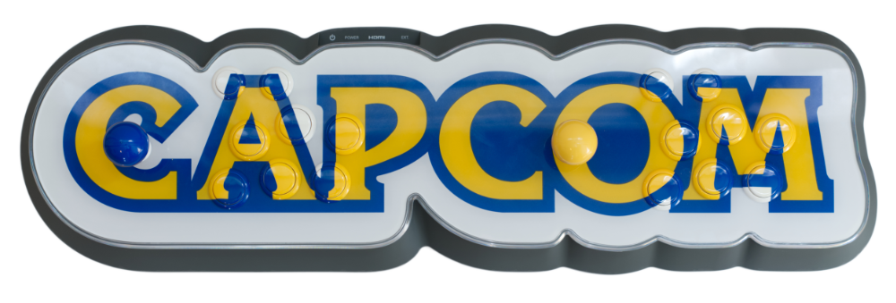
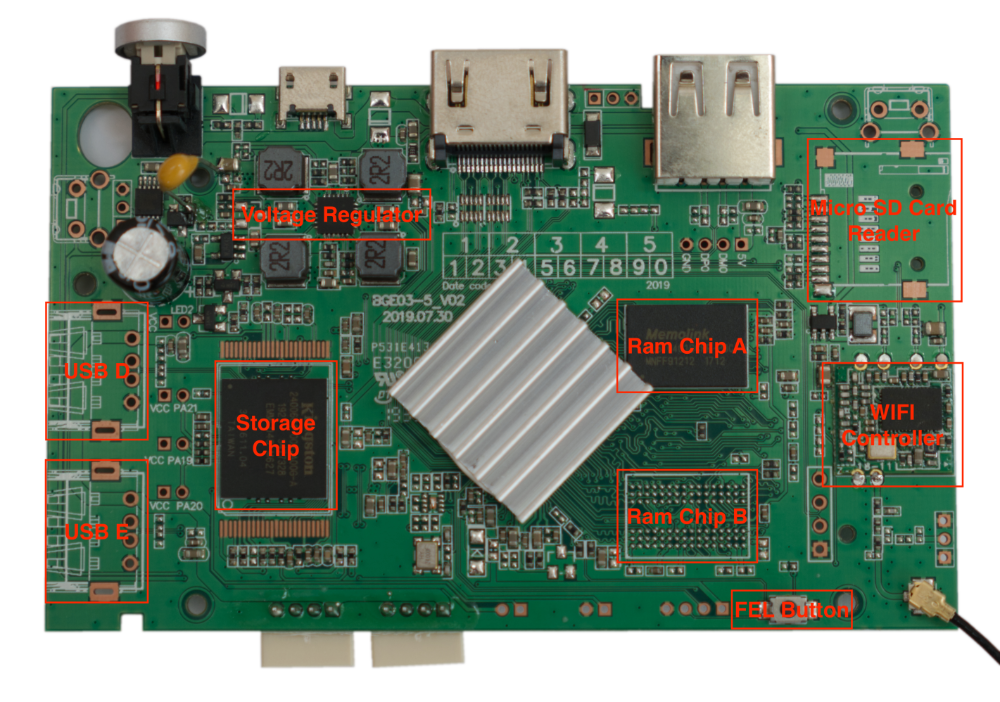
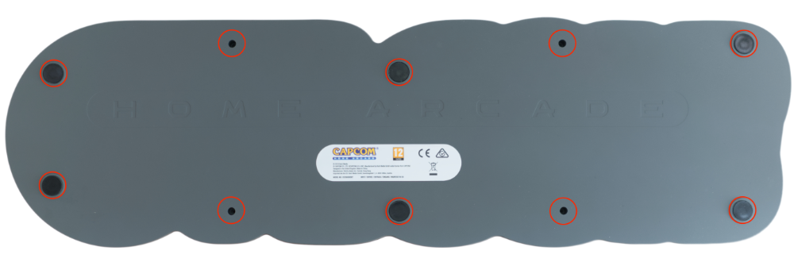
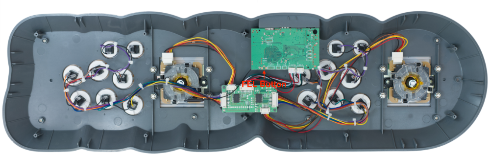
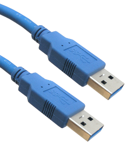

# Unofficial Capcom Home Arcade Manual

# Table of Contents
1. [Introduction](#Introduction)
2. [OEM Software](#OEM-Software)
3. [Hardware](#Hardware)
4. [Hardware Modifications](#Hardware-Modifications)
5. [Purchasable Modifications](#Purchasable-Modifications)
6. [Installing Software](#Installing-Software)
7. [Communities](#Communities)
8. [Community Guides](#Community-Guides)
9. [Troubleshooting](#Troubleshooting)
10. [Downloads](#Downloads)
11. [Special Acknowledgments](#Special-Acknowledgments)

# Introduction
The Capcom Home Arcade (CHA from now on) is a device manufactured by Koch Media under license from Capcom.

A lot of effort was put on the device design. Is build using only high quality Sanwa parts and the surface mount don't have any visible screws.

Additionally, at the time of this writing at least, hardware specs are superior than direct competitors.

These reasons made the device a favourite one to customise and build a self-contained small home arcade setup.

# OEM Software
The OEM operating system shows a simple but friendly user interface.

The device comes with 16 games pre-installed available from the user interface.

At the time of this writing there is no official means to purchase additional games.

# Hardware

Custom SOC based on Orange PI PC ([Allwinner H3 SOC](https://linux-sunxi.org/H3)):
- Fixed Voltage Regulator: A8030
- CPU : Quad-Core Cortex-A7 ARM CPU (1.08Ghz at 1.2v)
- GPU : Mali400 MP2 (576Mhz)
- DDR3 : 512MB 1248 (624MHz)
- Storage: 4GB EMMC
- WIFI Controller: Realtek RTL8188ETV supporting 802.11bgn 2.4G

Most obvious differences from a typical Orange PI PC:
- The CPU can't switch between voltages or clock speeds.
- Different WIFI controller.
- Has a 4GB EMMC of fast storage.
- Doesn't have the 9 Pin Micro SD Card Slot. (has a PCB slot to solder one, proven to work)
- Doesn't have two RAM chips, only one (has a PCB slot to solder a second one, untested).
- 3 USB ports: 1 Type A, 2 4-Pin connectors used internally. The additional 2 PCB slots where USB inputs could be soldered are electrically connected to the 2 4-Pin connectors. In practice only one of the two that are electrically connected can be used without issues.

# Hardware Modifications
As indicated above the PCB has some usable slots where parts could be soldered.

The most interesting and well documented one is the Micro SD Card Slot.

When a Micro SD Card is available the board disables EMMC and uses the Micro SD Card to boot and in FEL mode.

This makes possible to keep the OEM operating system in EMMC and install software directly on the Micro SD Card. This allows to avoid the need of using FEL mode to install software.

Is said that the first 2000 units produced of the CHA where sent to Germany and included the Micro SD Cart Slot.

# Purchasable Modifications

## Wireless Bluetooth PCB Board for compatibility with Nintendo Switch, PC and Playstation 4

This board can be easily found at Amazon in two variants under the names:
- IntecGaming Wireless Bluetooth PCB Board for Capcom Home Arcade Console to Nintendo Switch/PC/Steam Wireless Controller
- IntecGaming Wireless Bluetooth PCB Board for Capcom Home Arcade Console to Playstation 4 Wireless Controller

It replaces the OEM controller board and adds compatibility with other consoles and PC over bluetooth.

# Installing Software

The next method can be used not only to install alternative software to the oem but also to recover the system in case any problem happens.

## Opening the device
To reach the SOC is necessary to open the device, thankfully this is quite straightforward.

The backplate of the device has 10 screws, 4 of them are visible and 6 under rubber pads.

Is recommended to heat the rubber pads and get an opening pick (or any flexible thin piece of plastic) under the glue, then push out slowly, this should leave the glue on the rubber pad and the backplate clean. Failing to do this can easily leave the rubber pads unusable.

This leaves the insides of the device perfectly reachable.

No additional disassembling is needed to install software.

## Enabling FEL mode

As other boards of this kind FEL mode can be enabled.

This allows to read and write the complete contents inside storage.

Requirements:
- USB Type A Male to USB Type A Male cable.

Steps:
1. Remove the Micro-USB power adapter. In FEL mode the board will be powered from the external USB.
2. Press the FEL mode button and hold it. Is easily reachable getting the finger under the board. It clicks when pressed, surprisingly requires a bit more pressure than expected to get pressed.
3. Connect the USB Type A to the PC. After the device has been detected (Windows plays a sound), the FEL button can be released.
4. Download [this](software/CHA_FEL_MODE.zip) software, uncompress and use 'start.bat' (Windows) or 'start.sh' (Linux) to enable access to the board's storage.

Note: The first time doing the steps above the device will be detected as an UNKNOWN device. To fix this use Zadig USB driver installer from [here](https://zadig.akeo.ie).

## Reading EMMC/Storage (Backup)
Before attempting any modification is recommended to do a backup of the factory storage.

A typical tool to do this is HDDRawCopy, it can be downloaded from [here](https://hddguru.com/software/HDD-Raw-Copy-Tool/), can write to a file a raw image of full contents of storage.

## Writing EMMC/Storage (Installing Software)
Both HDDRawCopy and Etcher can be used, Etcher is preferred, it can be downloaded from [here](https://www.balena.io/etcher/).

## Closing the device
Is possible to put back all ten crews and then the rubber pads.

Or alternatively ...

Put the rubber pads first and only the four visible screws.

Last option will allow to easily open the device again to access the FEL mode button at a latter point.

# Communities
- [Reddit](https://www.reddit.com/r/CapcomHomeArcade/)
- [Discord](https://discord.gg/4jsNqRZUzS)

# Community Guides
- [Top Plate Teardown](https://www.reddit.com/r/CapcomHomeArcade/comments/nsb9xy/cha_top_plate_teardown_video/)

# Troubleshooting
- If for any reason the device doesn't work properly try to reinstall an OS using FEL mode.

# Downloads
## High Resolution Images
- Find high resolution images of the device and PCB [here](images-hd).

## Officially Supported Software
The next software can be downloaded and directly written to EMMC, is also supported for the CHA by their original developers.

### OEM operating system
The OS that comes pre-installed on the Capcom Home Arcade.

- v1.4 [Download From CHA](https://cha.tbbrds.com/img/cha-1.4.img)
- v1.5 [Download From CHA](https://cha.tbbrds.com/img/cha-1.5.img)
- v1.6 [Download From CHA](https://cha.tbbrds.com/img/cha-1.6.img) or [Download From Archive](https://archive.org/download/capcom-home-arcade-oem-16.img/capcom-home-arcade-oem-16.img.gz)

Alternative Kernel version, "may" fix some sound issues.
- v1.6-alt (Alternative Kernel) [Download From CHA](https://cha.tbbrds.com/img/cha-1.6-alt.img)

### Official Batocera Distribution
[Batocera](https://batocera.org) is an open source retro distribution.

- v32 [Download From batocera.org](https://updates.batocera.org/cha/stable/last/batocera-cha-32-20210924.img.gz)

### Official Lakka Distribution
[Lakka](http://www.lakka.tv) is the official open source retro distribution from libretro for Retroarch.

- v3.5 [Download From lakka.tv](https://le-builds.lakka.tv/H3.arm/Lakka-H3.arm-3.5-capcom-home-arcade.img.gz)

## Other Software
The next are custom images that can also be directly written to EMMC but are not distributed by their original developers.

- Multi OS Boot images from CHOKO Group [Download From CHOKO Group GitHub](https://github.com/ChokoGroup/CHA-Multi-OS-Boot)
- Custom Batocera Setup by Lilo-San, only supports CPS1,2,3 and NeoGeo games [Download From Lilo-San GitHub](https://github.com/lilo-san/cha-batocera)

# Special Acknowledgments
- [CHOKO Group](https://github.com/ChokoGroup). They where the first ones to open the CHA development opportunities to a wider audience and put together the package to enable FEL mode. They also wrote the first beginner friendly guide to use it.
- [Batocera Team](https://batocera.org). Demetris in particular for taking over the port of Batocera for the CHA and answer many questions.
- [Koch Media](https://capcomhomearcade.com). For creating a good licensed product and supporting its Reddit community.
